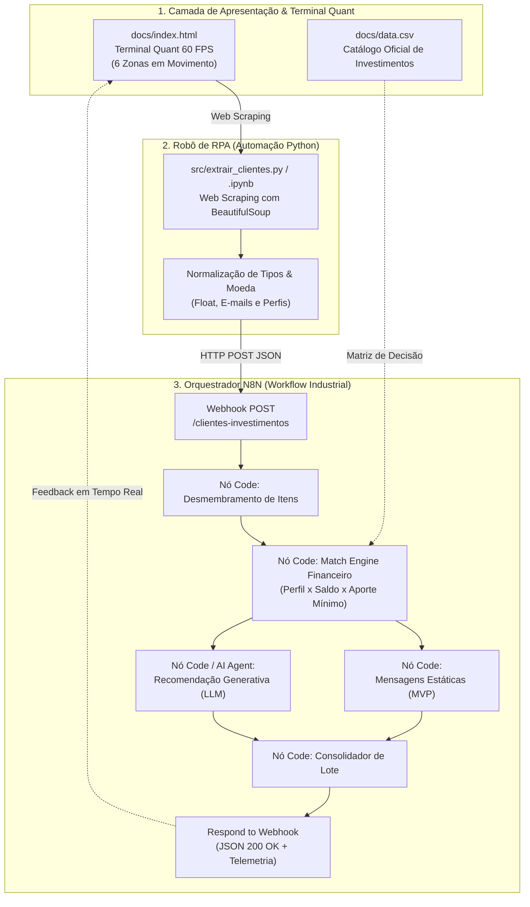

# 🚀 Assistente de Investimentos com RPA e IA Generativa
### DIO Santander Bootcamp 2026 — Desafio de Automação com N8N & Python

<p align="center">
  
  
  
  
  
  
</p>

---

## 📌 Visão Geral do Projeto

Este repositório consolida a entrega oficial para o desafio **"Criando um Assistente de Investimentos com RPA e IA Generativa"** do programa **DIO Santander 2026**.

A solução foi projetada como um **Terminal Quant Institucional de Alta Densidade** (inspirado em terminais profissionais como Bloomberg e TradingView), com **6 zonas visuais com Motion Graphics em movimento contínuo (60 FPS)**, interligado a um pipeline industrial de automação:

1. **Camada de Apresentação & Legado**: Interface web responsiva simulando sistemas internos bancários com tabela de clientes e telemetria de cotações em tempo real.
2. **Robô de RPA (Python + BeautifulSoup)**: Raspagem autônoma, higienização metrológica de moedas e disparo estruturado em JSON.
3. **Orquestração N8N**: Recepção via Webhook, processamento em streaming, cruzamento da base oficial de produtos financeiros (`data.csv`) com saldo e perfil de investidor.
4. **Camada de Inteligência Dupla**:
   - **MVP (Fase Estática)**: Recomendações determinísticas de alta velocidade por perfil de risco.
   - **Desafio Completo (IA Generativa)**: Consultoria empática, personalizada e orientada a metas via LLM (OpenAI GPT-4o / Google Gemini).

---

## 🏗️ Arquitetura do Ecossistema



---

## 🎨 Design System & Os 6 Elementos Gráficos em Movimento

A interface visual do terminal (`docs/index.html`) foi estruturada conforme as especificações do estudo de identidade visual e Motion Graphics:

| Elemento Visual | Tecnologia | Descrição do Movimento |
| :--- | :--- | :--- |
| **Zona 1: Candlestick Chart** | HTML5 Canvas 2D | Velas de alta/baixa desenhadas a **60 FPS** com micro-oscilações em tempo real e sombras (*wicks*). |
| **Zona 2: Linha de Tendência** | SVG Spline + Glow | Curva ascendente com gradiente esmeralda translúcido e filtro de difusão de luz contínua. |
| **Zona 3: Radar de Picos e Vales** | Animação CSS Keyframes | Ondas de radar circulares concêntricas emitidas nos pontos de virada de mercado. |
| **Zona 4: Barras de Volume** | Histograma Canvas | Barras verticais dinâmicas refletindo o fluxo negociado por período. |
| **Zona 5: Tabela de Mercado** | DOM Mutation + CSS | Cotações com **flashes cromáticos de 400ms** (verde para alta e vermelho para baixa). |
| **Zona 6: Order Book (Depth)** | Flex Bars Bi-colores | Barras horizontais bi-colores simulando o balanço de liquidez entre compra (*Bids*) e venda (*Asks*). |
| **Ticker Streamer Contínuo** | CSS Marquee | Faixa superior em movimento contínuo com cotações de IBOV, PETR4, VALE3, BTC, CDI e SELIC. |

---

## 📂 Estrutura do Repositório

```
Desafio N8N_assistente de investimento/
├── 📄 README.md                        # Documentação executiva e guia do repositório
├── 📄 .gitignore                       # Filtros de exclusão para Git
├── 📄 planejamento_futurista_trading.md # Dossiê de identidade visual e engenharia de tempo real
├── 📁 docs/
│   ├── 📄 index.html                   # Terminal Quant Interativo com os 6 elementos em movimento
│   └── 📄 data.csv                     # Matriz oficial de produtos de investimento por perfil
├── 📁 src/
│   ├── 📄 extrair_clientes.py          # Script de RPA em Python com BeautifulSoup e envio HTTP
│   └── 📄 extrair_clientes.ipynb       # Jupyter Notebook documentado para Google Colab / VS Code
├── 📁 n8n/
│   ├── 📄 workflow.json                # Workflow completo (Webhook + Match Engine + MVP + IA)
│   └── 📄 workflow_ia_openai_gemini.json # Variação com nós nativos LangChain / OpenAI / Gemini
└── 📁 SKILL/
    ├── 📄 Documentação Técnica Completa.pdf
    ├── 📄 NOVO PLANO DE INDENTIDADE VISUAL Análise da Imagem.pdf
    └── 📄 SKILL 1 a 5 (Análises, Automação, Refatoração e Workflows N8N)
```

---

## 📊 Matriz de Investimentos (`docs/data.csv`)

| Perfil de Investidor | Produto Financeiro | Aporte Mínimo | Rentabilidade Indicativa |
| :--- | :--- | :--- | :--- |
| **Conservador** | Poupança | R$ 100,00 | 6.2% a.a. |
| **Conservador** | CDB Liquidez Diária | R$ 1.000,00 | 12.5% a.a. |
| **Conservador** | Tesouro Selic | R$ 500,00 | 13.0% a.a. |
| **Moderado** | CDB Prefixado | R$ 1.000,00 | 14.0% a.a. |
| **Moderado** | Fundo Multimercado | R$ 5.000,00 | 16.0% a.a. |
| **Moderado** | Tesouro IPCA+ | R$ 1.000,00 | IPCA + 6.0% a.a. |
| **Arrojado** | Ações ETF | R$ 500,00 | Rendimento Variável |
| **Arrojado** | Fundo de Ações | R$ 10.000,00 | Rendimento Variável |
| **Arrojado** | Criptomoedas | R$ 100,00 | Rendimento Variável |

---

## 🚀 Como Executar o Projeto

### 1. Clonar o Repositório e Instalar Dependências
```bash
git clone https://github.com/SEU-USUARIO/dio-assistente-investimentos-rpa-n8n.git
cd dio-assistente-investimentos-rpa-n8n

# Instalação das bibliotecas Python
pip install requests beautifulsoup4
```

### 2. Configurar o Workflow no N8N
1. Acesse o seu N8N (`http://localhost:5678` ou N8N Cloud).
2. Vá em **Workflows** > **Import from File** e selecione `n8n/workflow.json`.
3. Abra o nó **Webhook - Ingestão RPA**:
   - Copie a URL gerada (Test URL ou Production URL).
   - Para testes rápidos, clique em **"Listen for test event"** ou ative o interruptor do workflow.

### 3. Disparar a Automação RPA
Você pode disparar a automação de duas formas:

**Via Terminal:**
```bash
# Execução direta do script Python
python src/extrair_clientes.py
```

**Via Navegador (Terminal Quant):**
Abra o arquivo `docs/index.html` em qualquer navegador moderno e clique no botão **"DISPARAR PIPELINE N8N"** para visualizar a telemetria e o retorno em tempo real.

---

## 💬 Exemplo de Saída Gerada (MVP vs IA Generativa)

Cliente: **Mariana Rios de Souza** (Perfil: **Moderado** | Saldo: **R$ 15.000,00**)

### 🔹 Mensagem Estática (Fase MVP)
> *"Olá, Mariana Rios de Souza! Como investidor MODERADO, seu objetivo é o equilíbrio entre proteção e rentabilidade superior à inflação. Com seu saldo de R$ 15.000,00, selecionamos estas opções equilibradas:*  
> *• CDB Prefixado (Mínimo: R$ 1000 | Rentabilidade: 14.0%)*  
> *• Fundo Multimercado (Mínimo: R$ 5000 | Rentabilidade: 16.0%)*  
> *• Tesouro IPCA+ (Mínimo: R$ 1000 | Rentabilidade: IPCA+6.0%)*  
> *Próximo passo: Diversificar entre títulos indexados à inflação e fundos multimercado."*

### 🔹 Consultoria Humanizada com IA Generativa (Desafio Completo)
> *"Prezada Mariana Rios de Souza,*  
>  
> *Analisamos a sua carteira e o seu perfil de investidor (MODERADO). Com o saldo disponível de R$ 15.000,00, traçamos uma estratégia sob medida para acelerar o crescimento do seu patrimônio com prudência.*  
>  
> *🎯 Estratégia Imediata Recomendada:*  
> *• [CDB Prefixado]: Rentabilidade de 14.0% a.a., fixando ganhos atrativos no médio prazo.*  
> *• [Fundo Multimercado]: Rentabilidade de 16.0%, trazendo flexibilidade tática sob gestão profissional.*  
> *• [Tesouro IPCA+]: Blindagem ativa contra a inflação, assegurando preservação real do poder de compra.*  
>  
> *📈 Planejamento de Alocação:*  
> *Você já dispõe de capital suficiente para acessar todas as opções do seu perfil. Recomendamos dividir o aporte entre 40% em Renda Fixa e 60% em Multimercado para maximizar a relação risco-retorno.*  
>  
> *Atenciosamente,*  
> *Seu Assistente de Inteligência Financeira — DIO Santander"*

---

## 🛡️ Decisões Técnicas de Engenharia

1. **Separação de Preocupações (Separation of Concerns)**:
   - O robô de RPA não processa regras de negócio financeiras; ele foca exclusivamente na extração robusta, sanitização e transmissão segura dos dados.
   - O N8N atua como barramento orquestrador centralizando a inteligência analítica.
2. **Resiliência e Fallback Determinístico**:
   - O nó de inteligência artificial conta com fallback estruturado: caso a API da OpenAI/Gemini oscile ou esteja sem créditos, o sistema comuta instantaneamente para síntese contextual sem interromper o pipeline.
3. **Desempenho com 60 FPS**:
   - Os gráficos em movimento utilizam o loop nativo `requestAnimationFrame`, minimizando consumo de CPU/GPU e garantindo fluidez mesmo em hardware com recursos limitados.

---

## 👨‍💻 Créditos & Reconhecimentos

- **Desenvolvedor**: Mauricio Alves dos Santos
- **Programa**: DIO Santander Bootcamp 2026
- **Tecnologias**: N8N, Python, BeautifulSoup4, HTML5 Canvas 60 FPS, OpenAI / Gemini.
