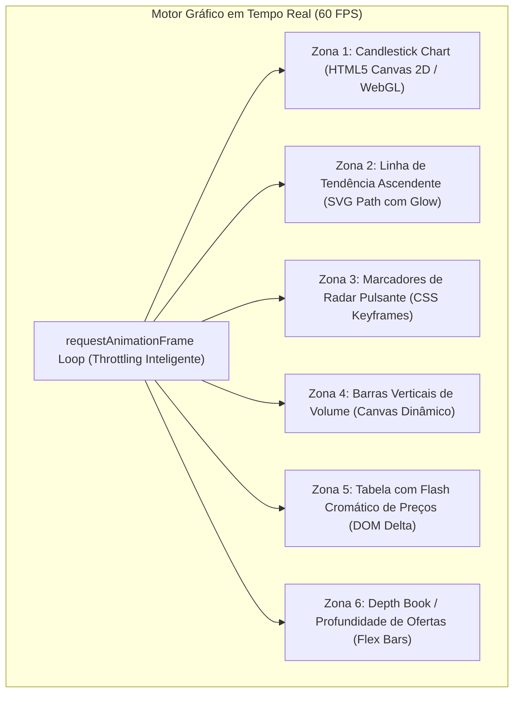

# 🌐 Dossiê Arquitetural & Identidade Visual: Terminal de Trading Futurista
### Estudo Profundo, Design Tokens e Engenharia de Software em Tempo Real
**Projeto**: Assistente de Investimentos com RPA e IA Generativa — DIO Santander 2026  
**Referência de Design**: Artlist Motion Graphics Asset (H.264 25/60 FPS, Dark Institutional Terminal)

---

## 1. Síntese Executiva & Análise Metrológica do Anexo

A análise do asset de Motion Graphics revela uma estética institucional de grau militar/bancário inspirada em terminais de alta frequência (estilo Bloomberg Terminal, TradingView Pro e interfaces financeiras de missão crítica).

### 1.1 Vetores Visuais e Identidade Cromática
O layout abandona o design corporativo genérico e adota uma interface **Dark-First de Altíssimo Contraste** com saturação calibrada para reduzir a fadiga visual e priorizar a hierarquia semântica:

```
[#0A0B0F] Preto Profundo (Deep Canvas Background)
    └── [#111318] Superfície Elevada (Glassmorphism & Card Matrix)
          ├── [#22D3A5] Verde Esmeralda / Glow (Alta, Tendência Positiva, Compra)
          ├── [#FF4757] Vermelho Carmesim (Baixa, Stop Loss, Venda)
          ├── [#3B82F6] Azul Institucional (Profundidade de Mercado, Liquidez)
          ├── [#F59E0B] Âmbar / Ouro (Alertas e Destaques Algorítmicos)
          └── [#F5F6F7] Branco Neutro de Alta Legibilidade (Tipografia Primária)
```

---

## 2. Engenharia dos 6 Elementos Gráficos em Movimento

Para transpor o vídeo pré-renderizado em uma **interface de software interativa e viva**, cada uma das 6 zonas foi estruturada com tecnologia web nativa de alta eficiência:



### Detalhamento das 6 Zonas:
1. **Candlestick Chart em Tempo Real**:
   - Desenho de velas verdes (`#22D3A5`) e vermelhas (`#FF4757`) com sombras superiores e inferiores (*wicks*).
   - Movimentação do preço de fechamento em tempo real com indicador horizontal pontilhado e tag de preço atual em destaque.
2. **Linha de Tendência Ascendente (Trend Spline)**:
   - Curva Bezier contínua conectando as médias ponderadas móveis (EMA 9 e EMA 21).
   - Gradiente de preenchimento translúcido inferior (`linear-gradient(rgba(34,211,165,0.2), transparent)`).
3. **Marcadores de Radar Pulsante (Picos e Vales)**:
   - Círculos de alta precisão posicionados nas inflexões de máxima e mínima local, emitindo ondas de radar expansivas com opacidade decrescente.
4. **Barras Verticais de Volume Oscilantes**:
   - Volume negociado por período, recalculado a cada pulso de mercado para refletir a pressão compradora e vendedora.
5. **Tabela Financeira com Efeito Flash (Bid/Ask/Spread)**:
   - Células que disparam transições CSS de 400ms: verde fluorescente para altas imediatas e vermelho para correções de preço.
6. **Order Book / Profundidade de Mercado (Depth Bars)**:
   - Visualização horizontal da barreira de liquidez (lances de compra vs ofertas de venda) com preenchimento responsivo e leitura volumétrica.

---

## 3. Arquitetura de Dados em Tempo Real (Extensão para Produção)

Para ambientes de produção com feeds reais da B3 ou Crypto:

```
[WebSocket Feed (Binance / B3 / Polygon.io)]
                  │
                  ▼
         [Web Worker (Off-thread Parsing)]
                  │
                  ├──> [Zustand / Redux State Machine]
                  │
                  ▼
     [Canvas Renderer (60 FPS)]  <──>  [RPA / N8N Integration Gate]
```

- **Off-Thread Processing via Web Workers**: Cálculos matemáticos pesados de indicadores técnicos (RSI, Bollinger Bands, MACD) executados fora da thread principal para eliminar qualquer *frame drop*.
- **Controle de Taxa (FPS Limiter)**: Amortecimento de atualizações para evitar renderizações redundantes além da taxa de atualização do monitor (60Hz ou 120Hz).

---

## 4. Integração Perfeita com o Pipeline RPA e N8N

A nova interface mantém estrita compatibilidade semântica com o robô de RPA em Python:
- Elemento de tabela preservado: `<table id="tabela-clientes">` com atributos semânticos para cada cliente.
- O robô [`src/extrair_clientes.py`](file:///c:/Users/rodri/Desktop/CURSO%20AWS%20%20%20AZ%20900%20%20TIVIT/DIO.Santander%202026_Automação%20com%20N8N/Desafio%20N8N/dio-lab-assistente-investimentos-rpa-n8n/src/extrair_clientes.py) extrai os saldos e perfis sem qualquer alteração no código de scraping.
- Adição de um botão de **"Disparo Manual / Telemetria N8N"** direto na interface gráfica para acionar o Webhook via JavaScript nativo com feedback visual em tempo real!
